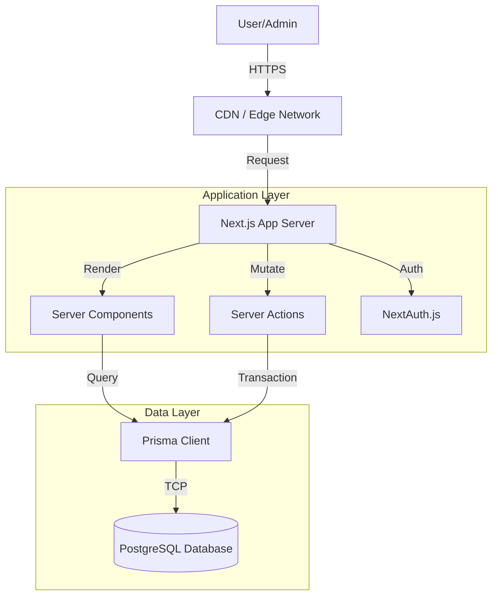
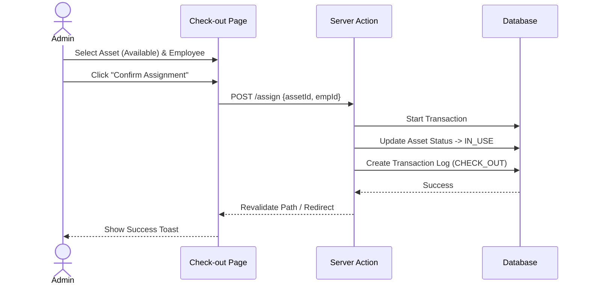

# Fixed Asset Management System Architecture Document

## 1. Introduction
This document outlines the overall project architecture for the **Simple Fixed Asset Management System**. It serves as the blueprint for development, ensuring consistency and adherence to chosen patterns.

**Relationship to Frontend Architecture:**
This project utilizes a **Full-stack Framework (Next.js)** approach. Therefore, the frontend and backend architecture are tightly integrated. This document covers the full stack, with specific UI details referenced from the `fixed_asset_ui_spec.md`.

### Starter Template
**Decision:** Greenfield Project (No specific starter template, but initialized via `create-next-app`).
**Rationale:** Allows for a clean slate optimized for the specific "Simple" requirements without unnecessary bloat.

### Change Log
| Date       | Version | Description                 | Author      |
| ---------- | ------- | --------------------------- | ----------- |
| 2025-12-01 | 1.0     | Initial Architecture Design | Antigravity |

---

## 2. High Level Architecture

### Technical Summary
The system follows a **Monolithic Architecture** built on the **Next.js** framework. It utilizes **Server Components** for efficient data rendering and **Server Actions** for data mutations, minimizing the need for a separate API layer. The database is a relational **PostgreSQL** instance managed via **Prisma ORM**. Styling is handled by **Tailwind CSS**.

### High Level Overview
1.  **Architectural Style:** Monolith (Full-stack Next.js Application).
2.  **Repository Structure:** Monorepo (Single Git repository).
3.  **Service Architecture:** Single Service (Application + API in one).
4.  **Data Flow:**
    -   **Read:** Server Component -> Prisma -> DB -> UI
    -   **Write:** Client Component -> Server Action -> Prisma -> DB -> Revalidate Path -> UI Update

### High Level Project Diagram


### Architectural and Design Patterns
-   **Server-Side Rendering (SSR):** Default for data fetching to ensure performance and SEO (if needed internally).
-   **Server Actions:** For handling form submissions and mutations, reducing client-side JavaScript.
-   **Repository Pattern (via Prisma):** Prisma acts as the abstraction layer for database access.
-   **Component-Based UI:** Reusable UI components (Atomic Design inspiration) using Tailwind CSS.

---

## 3. Tech Stack

| Category       | Technology   | Version          | Purpose              | Rationale                                                      |
| :------------- | :----------- | :--------------- | :------------------- | :------------------------------------------------------------- |
| **Framework**  | Next.js      | 14+ (App Router) | Full-stack Framework | React-based, built-in routing, SSR, and API capabilities.      |
| **Language**   | TypeScript   | 5.x              | Development Language | Type safety, better DX, and maintainability.                   |
| **Styling**    | Tailwind CSS | 3.x              | CSS Framework        | Utility-first, rapid UI development, consistent design system. |
| **Database**   | PostgreSQL   | 15+              | Relational Database  | Robust, reliable, handles complex relationships (Asset-User).  |
| **ORM**        | Prisma       | 5.x              | Database Access      | Type-safe database queries, easy schema management.            |
| **Auth**       | NextAuth.js  | 5.x (Beta)       | Authentication       | Simple integration with Next.js, supports multiple providers.  |
| **UI Library** | Shadcn/UI    | Latest           | Component Library    | Accessible, customizable, based on Radix UI & Tailwind.        |
| **Icons**      | Lucide React | Latest           | Iconography          | Clean, consistent icons matching the design spec.              |

---

## 4. Data Models

### AssetType
**Purpose:** Categorizes assets (e.g., Laptop, Monitor).
**Key Attributes:**
-   `id`: Int (PK)
-   `name`: String (Unique)
-   `description`: String (Optional)

### Asset
**Purpose:** Represents the physical item.
**Key Attributes:**
-   `id`: Int (PK)
-   `code`: String (Unique, Asset Tag)
-   `name`: String
-   `serialNumber`: String
-   `status`: Enum (AVAILABLE, IN_USE, MAINTENANCE, RETIRED)
-   `purchaseDate`: DateTime
-   `price`: Decimal

### Employee
**Purpose:** Represents the user who holds the asset.
**Key Attributes:**
-   `id`: Int (PK)
-   `firstName`: String
-   `lastName`: String
-   `email`: String (Unique)
-   `department`: String

### Transaction (Log)
**Purpose:** Records the history of asset movement.
**Key Attributes:**
-   `id`: Int (PK)
-   `action`: Enum (CHECK_OUT, CHECK_IN)
-   `date`: DateTime
-   `notes`: String
-   `assetId`: FK -> Asset
-   `employeeId`: FK -> Employee

---

## 5. Components

### 5.1 Asset Management Module
**Responsibility:** CRUD operations for Assets and Asset Types.
**Key Interfaces:**
-   `getAssets(filter)`
-   `createAsset(data)`
-   `updateAsset(id, data)`
**Dependencies:** Prisma Client

### 5.2 Assignment Module
**Responsibility:** Handles Check-in and Check-out logic.
**Key Interfaces:**
-   `assignAsset(assetId, employeeId, date)`
-   `returnAsset(assetId, returnDate, condition)`
**Dependencies:** Asset Management Module (to update status), Transaction Module (to log)

### 5.3 Dashboard Module
**Responsibility:** Aggregates data for the overview.
**Key Interfaces:**
-   `getAssetStats()`
-   `getRecentActivities()`
**Dependencies:** Prisma Client

---

## 6. Core Workflows

### Check-out Workflow


---

## 7. Database Schema (Prisma)

```prisma
model AssetType {
  id          Int      @id @default(autoincrement())
  name        String   @unique
  description String?
  assets      Asset[]
}

model Asset {
  id           Int           @id @default(autoincrement())
  code         String        @unique
  name         String
  serialNumber String?
  status       AssetStatus   @default(AVAILABLE)
  purchaseDate DateTime?
  price        Decimal?
  typeId       Int
  type         AssetType     @relation(fields: [typeId], references: [id])
  transactions Transaction[]
  
  createdAt    DateTime      @default(now())
  updatedAt    DateTime      @updatedAt
}

enum AssetStatus {
  AVAILABLE
  IN_USE
  MAINTENANCE
  RETIRED
}

model Employee {
  id           Int           @id @default(autoincrement())
  firstName    String
  lastName     String
  email        String        @unique
  department   String?
  transactions Transaction[]
}

model Transaction {
  id         Int               @id @default(autoincrement())
  action     TransactionAction
  date       DateTime          @default(now())
  notes      String?
  assetId    Int
  asset      Asset             @relation(fields: [assetId], references: [id])
  employeeId Int
  employee   Employee          @relation(fields: [employeeId], references: [id])
}

enum TransactionAction {
  CHECK_OUT
  CHECK_IN
}
```

---

## 8. Source Tree

```text
project-root/
├── app/                        # Next.js App Router
│   ├── (auth)/                 # Auth routes group
│   ├── (dashboard)/            # Protected dashboard routes
│   │   ├── assets/             # Asset management pages
│   │   ├── operations/         # Check-in/out pages
│   │   └── page.tsx            # Dashboard home
│   ├── api/                    # API Routes (if needed)
│   ├── layout.tsx              # Root layout
│   └── page.tsx                # Landing/Login
├── components/                 # React Components
│   ├── ui/                     # Shadcn UI components (Button, Input, etc.)
│   ├── assets/                 # Asset-specific components (AssetTable, AssetForm)
│   └── layout/                 # Sidebar, Header
├── lib/                        # Shared utilities
│   ├── prisma.ts               # Prisma client instance
│   └── utils.ts                # Helper functions
├── prisma/                     # Database schema
│   └── schema.prisma
├── public/                     # Static assets
└── package.json
```

---

## 9. Infrastructure and Deployment

### Deployment Strategy
-   **Platform:** Vercel (Recommended for Next.js) or Dockerized Container on Cloud Run/EC2.
-   **CI/CD:** GitHub Actions (Lint -> Build -> Test -> Deploy).

### Environments
-   **Development:** Localhost + Local Postgres.
-   **Production:** Vercel/Cloud + Managed Postgres (e.g., Supabase, Neon, or RDS).

---

## 10. Security

### Authentication & Authorization
-   **Auth Method:** NextAuth.js (Credentials or OAuth).
-   **Protection:** Middleware to protect `/dashboard` routes.

### Input Validation
-   **Library:** Zod (Schema validation).
-   **Validation:** All Server Actions must validate input using Zod schemas before processing.

### Data Protection
-   **Secrets:** Environment variables (`.env`) for DB_URL, NEXTAUTH_SECRET.
-   **Logs:** No sensitive PII in logs.

---

## 11. Coding Standards

### Critical Rules
-   **Type Safety:** No `any`. Define interfaces for all props and data models.
-   **Server Actions:** Use `use server` at the top of action files. Always wrap in `try/catch` and return standardized result objects `{ success: boolean, data?: any, error?: string }`.
-   **Components:** Use "Client Components" (`use client`) only when interactivity (hooks) is needed. Prefer Server Components for data fetching.
-   **Styling:** Use Tailwind utility classes. Avoid inline styles.

---

## 12. Tool Usage & MCP Context 7 (Mandatory Dependency)

MCP Context 7 เป็น mandatory dependency
Agent ต้องอ่านและโหลด MCP Context 7 ก่อนเริ่ม reasoning ทุกครั้ง

ห้าม:
- เลือก
- ใช้
- อ้างอิง
tool ใด ๆ ก่อนตรวจสอบ MCP Context 7

ถือว่ามีการ "ใช้ tool" เมื่อมีอย่างน้อยหนึ่งข้อ:
- ใช้ library / framework
- ใช้ ORM, database access, auth, validation
- ใช้ pattern หรือ configuration ใด ๆ
- ใช้ tool ที่ถูกกำหนดไว้แล้วใน Architecture

### Enforcement Flow (บังคับตามลำดับ)

Step 1: MCP Context 7 Check  
- ต้องตรวจสอบ tool และ guideline จาก MCP Context 7
- หาก MCP Context 7 ไม่มีข้อมูล:
  - หยุดการทำงานทันที
  - รายงานข้อมูลที่ขาด
  - ห้ามเดา ห้าม workaround

Step 2: Tool Validation  
- tool ต้อง:
  - มีอยู่ใน MCP Context 7
  - ไม่มี anti-pattern หรือข้อห้าม
  - สอดคล้องกับ Architecture

## 13. Git Workflow (Auto Commit – Mandatory)

### Completion Rule

User Story จะถือว่า "เสร็จสมบูรณ์" ก็ต่อเมื่อ:
- task ครบเเละ ถูกต้องตาม Acceptance Criteria
- มี Git Commit สำเร็จแล้ว

หากยังไม่มี commit:
- ถือว่างานยังไม่เสร็จ

---

### Commit Authority

Agent ได้รับอนุญาตให้:
- รัน git add .
- รัน git commit

Agent ไม่มีสิทธิ์:
- amend commit
- force push
- push ขึ้น remote

---

### Commit Trigger

Agent ต้อง commit อัตโนมัติเมื่อ:
- implement User Story ได้ครบตาม Acceptance Criteria
- โค้ด map กับ User Story เดียว
- ไม่มี assumption ที่ยังไม่ถูกระบุ

ห้าม commit เมื่อ:
- งานยังไม่ครบ User Story
- มีหลาย User Story ปะปน
- Context 7 Validation ขาดหรือไม่ชัดเจน

---

### Commit Format (Conventional Commits)

type(scope): summary

- type: feat | fix | refactor | test | chore | docs
- scope: ต้อง map กับ User Story เดียว
- summary: imperative, ≤ 72 chars

Commit Body (ถ้ามี):
- Implements: <User Story ID>
- Tooling: ผ่าน Context 7 Validation
- Architecture impact: (ถ้ามี)

---

### Commit Execution (Mandatory)

เมื่อเข้าเงื่อนไข commit:
1. git add .
2. git commit -m "<generated message>"

หากคำสั่งล้มเหลว:
- หยุดการทำงาน
- รายงาน error โดยไม่ retry เอง

## 14. Story Completion Verification (Mandatory)

Agent ต้องตรวจสอบและยืนยันว่า User Story เสร็จสมบูรณ์
ก่อนดำเนินการ Git Commit และก่อนเริ่ม Story ถัดไป

User Story จะถือว่า "เสร็จสมบูรณ์" ต่อเมื่อผ่านขั้นตอนต่อไปนี้ครบถ้วน

### Step 1: Acceptance Criteria Verification

Agent ต้อง:
- ตรวจสอบ Acceptance Criteria ทุกข้อของ Story ปัจจุบัน
- map แต่ละข้อกับ implementation ที่ทำไปแล้ว

Agent ต้องแสดงผลในคำตอบ:

### Acceptance Criteria Checklist
- [x] AC-1: <อธิบายว่าผ่านอย่างไร>
- [x] AC-2: ...
- [ ] AC-3: (หากยังไม่ผ่าน ต้องหยุด)

### Step 2: Task Coverage Verification

Agent ต้องยืนยันว่า:
- ทุก task / subtask ใน Story ถูก implement แล้ว
- ไม่มี task ใดถูกข้าม

รูปแบบการแสดงผล:

### Task Coverage
- [x] AssetTypeList component
- [x] AssetTypeForm modal
- [x] createAssetType action
- [x] updateAssetType action
- [x] deleteAssetType action

### Step 3: Error & Test Verification

Agent ต้อง:
- ระบุ test ที่เขียนหรือ logic ที่ใช้ยืนยันความถูกต้อง
- ตรวจสอบ edge cases ที่ระบุใน Acceptance Criteria

อย่างน้อยต้องครอบคลุม:
- validation error
- business rule error
- success path

หากไม่สามารถทดสอบได้จริง:
- ต้องอธิบายวิธี verify เชิง logic

### Step 4: Completion Gate

Story นี้จะถือว่าเสร็จสมบูรณ์ก็ต่อเมื่อ:
- Acceptance Criteria ผ่านครบทุกข้อ
- Task Coverage ครบ
- Context 7 Validation ครบ (ถ้ามี tool)
- ไม่มี error ที่ยังไม่ได้จัดการ

### Step 5: Commit & Progression

เมื่อผ่าน Completion Gate:
- Agent ต้องดำเนินการ Git Commit ตาม §13
- Commit ต้องอ้างอิง Story ID เดียว
- หลัง commit เสร็จ จึงเริ่ม Story ถัดไปได้

