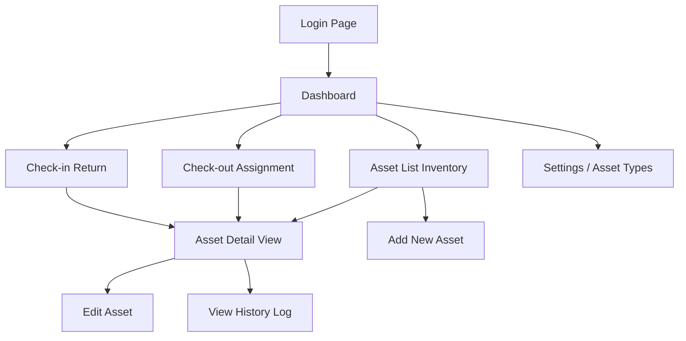

# Simple Fixed Asset Management System UI/UX Specification

## Introduction

This document defines the user experience goals, information architecture, user flows, and visual design specifications for the Simple Fixed Asset Management System. It serves as the foundation for visual design and frontend development, ensuring a cohesive and user-centered experience.

### Overall UX Goals & Principles

#### Target User Personas

**Asset Manager (Admin):** เจ้าหน้าที่ธุรการหรือ IT ที่รับผิดชอบดูแลทรัพย์สิน ต้องการเครื่องมือที่ช่วยให้ทำงานได้เร็ว ลดความผิดพลาดจากการจดบันทึก และตรวจสอบสถานะของได้ทันที

**Employee (User):** พนักงานทั่วไปที่ได้รับมอบหมายทรัพย์สิน ต้องการความโปร่งใสว่าตนเองถือครองอะไรอยู่บ้าง (ในอนาคตอาจมีฟังก์ชันดูรายการของตัวเอง)

#### Usability Goals

- **Efficiency:** ลดจำนวนคลิกในการทำรายการเบิก-จ่ายให้เหลือน้อยที่สุด
- **Clarity:** สถานะของสินทรัพย์ (Available, In Use, etc.) ต้องดูออกทันทีด้วยสีและสัญลักษณ์
- **Error Prevention:** ระบบต้องป้องกันการเบิกของที่ "ไม่ว่าง" หรือคืนของที่ "ไม่ได้ยืม"
- **Searchability:** สามารถค้นหาสินทรัพย์จากรหัส, ชื่อ, หรือ Serial Number ได้อย่างรวดเร็ว

#### Design Principles

1.  **Function over Form** - เน้นการใช้งานจริง ความเร็ว และความถูกต้องของข้อมูล
2.  **Clear Status Indication** - ใช้สีสื่อความหมายของสถานะอย่างชัดเจน (เขียว=ว่าง, ฟ้า=ใช้, แดง=เสีย/หาย)
3.  **Feedback Loop** - ทุกการกระทำต้องมีการตอบสนอง (Toast, Modal) เพื่อยืนยันความสำเร็จ

### Change Log

| Date       | Version | Description                          | Author      |
| ---------- | ------- | ------------------------------------ | ----------- |
| 2025-12-01 | 1.0     | Initial UI/UX specification creation | Antigravity |

## User Flows

### Core Workflows

**User Goal:** Admin ต้องการบริหารจัดการวงจรชีวิตของสินทรัพย์ ตั้งแต่รับเข้า เบิกจ่าย จนถึงรับคืน

**Entry Points:**
- Dashboard
- Sidebar Navigation

**Success Criteria:**
- สินทรัพย์ถูกเปลี่ยนสถานะอย่างถูกต้องตามความเป็นจริง
- ประวัติการใช้งานถูกบันทึกครบถ้วน

#### Flow Diagram

#### Edge Cases & Error Handling

-   **Double Booking:** ระบบต้อง lock สินทรัพย์ทันทีที่ถูกเลือกในหน้า Check-out เพื่อป้องกัน Admin 2 คนเบิกของชิ้นเดียวกันพร้อมกัน
-   **Network Error:** กรณีเน็ตหลุดขณะ Submit ให้แสดง Error Toast และคงข้อมูลใน Form ไว้
-   **Data Not Found:** ค้นหา Asset ID ไม่เจอ ให้แสดง Empty State พร้อมปุ่ม "Add New Asset"

## Wireframes & Mockups

### Key Screen Layouts

#### Dashboard

**Purpose:** ให้ผู้ดูแลระบบเห็นภาพรวมสถานะสินทรัพย์ทันทีที่เข้าใช้งาน และดูรายการเคลื่อนไหวล่าสุด

**Key Elements:**
-   **Welcome Section:** "สวัสดี, [Admin Name]"
-   **Stats Grid (4 Columns):**
    -   *Total Assets:* Icon (Box), Count
    -   *Available:* Icon (CheckCircle), Count (Color: Emerald)
    -   *In Use:* Icon (User), Count (Color: Blue)
    -   *Maintenance:* Icon (Tool), Count (Color: Amber)
-   **Recent Activity Table:** รายการเคลื่อนไหวล่าสุด 5-10 รายการ

**Interaction Notes:**
-   คลิกที่ Card สถานะ (เช่น Available) จะลิงก์ไปหน้า Asset List พร้อม Filter สถานะนั้นๆ

**Technical Implementation Notes:**
-   **Data Fetching:** Dashboard API ควร aggregate ข้อมูลมาให้เสร็จใน call เดียว เพื่อ performance

#### Asset List (Inventory)

**Purpose:** ค้นหาและดูรายการสินทรัพย์ทั้งหมด

**Key Elements:**
-   **Header Toolbar:** Title "Assets" + Button "Add Asset"
-   **Filter Bar:** Search Input, Filter Dropdown (Type, Status)
-   **Data Table:** Asset Code, Name, Category, Serial No., Status, Current Holder, Actions

**Interaction Notes:**
-   **Search:** Real-time search (debounce 300ms)
-   **Row Click:** ไปหน้า Asset Detail

**Technical Implementation Notes:**
-   **Pagination:** Server-side pagination
-   **Filtering:** ส่ง query params ไปที่ API

#### Check-out (Assignment)

**Purpose:** บันทึกการส่งมอบสินทรัพย์ให้พนักงาน

**Key Elements:**
-   **Select Asset:** Searchable Dropdown (Combobox) **(Filter: Status = Available Only)**
-   **Select Employee:** Searchable Dropdown
-   **Assignment Date:** Date Picker (Default = Today)
-   **Notes:** Textarea

**Interaction Notes:**
-   เมื่อเลือก Asset ให้แสดงรายละเอียดเบื้องต้น (รุ่น, Serial) ทันทีเพื่อยืนยันความถูกต้อง

#### Check-in (Return)

**Purpose:** บันทึกการรับคืนสินทรัพย์

**Key Elements:**
-   **Select Asset:** Searchable Dropdown **(Filter: Status = In Use Only)**
-   **Return Date:** Date Picker
-   **New Status:** Radio Group (Available, Maintenance, Retired)
-   **Condition/Notes:** Textarea

**Interaction Notes:**
-   ต้องบังคับเลือก New Status เสมอ

## Component Library / Design System

**Design System Approach:** ใช้ **Tailwind CSS** เป็นฐาน และสร้าง Reusable Components

### Core Components

#### StatusBadge Component

**Purpose:** แสดงสถานะของสินทรัพย์ด้วยสีที่สื่อความหมาย

**Variants:**
-   `Available`: Bg-emerald-100 Text-emerald-700
-   `In Use`: Bg-blue-100 Text-blue-700
-   `Maintenance`: Bg-amber-100 Text-amber-700
-   `Retired`: Bg-red-100 Text-red-700

#### AssetCard Component

**Purpose:** แสดงข้อมูลย่อของสินทรัพย์ในรูปแบบ Card (สำหรับ Mobile view หรือ Dashboard)

#### ActionTable Component

**Purpose:** ตารางแสดงข้อมูลมาตรฐาน พร้อม Pagination และ Sortable Headers

## Responsive Design Specification (Mandatory)

ระบบต้องรองรับการใช้งานทั้ง Desktop และ Mobile โดยไม่สูญเสีย feature หลัก

### Breakpoints (อ้างอิง Tailwind)
- Mobile: < 768px
- Desktop: ≥ 768px

### Global Rules
- ห้ามตัด feature ออกใน Mobile (เปลี่ยนรูปแบบได้ แต่ functionality ต้องครบ)
- ทุก action ต้องเข้าถึงได้ภายใน ≤ 2 interaction steps

### Layout Behavior

#### Navigation
- Mobile:
  - Sidebar ต้องถูกซ่อน
  - ใช้ Hamburger Menu (Drawer)
- Desktop:
  - Sidebar แสดงตลอด

#### Data Presentation
- Desktop:
  - ใช้ ActionTable เป็นหลัก
- Mobile:
  - เปลี่ยน Table → AssetCard List
  - Card ต้องแสดง:
    - Asset Name
    - StatusBadge
    - Primary Action (View / Edit)

### Responsive Acceptance Criteria
- [ ] Mobile view ไม่มี horizontal scroll
- [ ] ทุก action ใน Desktop ทำได้ใน Mobile
- [ ] Table ถูกแปลงเป็น Card อย่างถูกต้อง
- [ ] Status และ Action ยังมองเห็นชัดเจน

หากไม่ผ่านข้อใดข้อหนึ่ง ถือว่า UI ไม่เสร็จ

## Skeleton Loading Specification (Mandatory)

ทุกหน้าที่มีการดึงข้อมูลจาก API ต้องแสดง Skeleton Loading
ห้ามใช้ Spinner เปล่าแทน Skeleton

### When to Show Skeleton
- Initial page load
- Changing filter / pagination
- Navigation ระหว่างหน้า (ถ้ามี data fetch)

### Skeleton Rules
- Skeleton ต้องมี layout ใกล้เคียงกับ content จริงมากที่สุด
- จำนวน skeleton item ต้องเท่ากับ expected content (เช่น 5 rows)

### Screen-specific Skeleton

#### Dashboard
- Skeleton Card 4 ช่อง (Stat Cards)
- Skeleton Table สำหรับ Recent Activity

#### Asset List
- Skeleton Toolbar (Search + Filter)
- Skeleton Table Rows หรือ Card List (Mobile)

#### Forms (Check-in / Check-out)
- Skeleton เฉพาะ Select / Dropdown ที่โหลด async
- ไม่ block ทั้งหน้า

### Skeleton Acceptance Criteria
- [ ] ไม่มี UI กระโดด (layout shift) หลังโหลดเสร็จ
- [ ] Skeleton แสดงจน data พร้อมเท่านั้น
- [ ] Skeleton ถูกแทนที่ด้วย data จริงทันทีเมื่อ fetch สำเร็จ
- [ ] Error state ต้องไม่แสดง Skeleton

หากใช้ Spinner แทน Skeleton ถือว่าผิด UI Spec

## UI/UX Tooling (Mandatory)

โปรเจคนี้ใช้ UI/UX tooling package ต่อไปนี้เป็นมาตรฐานกลาง
สำหรับการพัฒนาและตรวจสอบคุณภาพ UI

### Primary UI/UX Tool

- Tool Name: ui-ux-pro-max-skill
- Repository: https://github.com/nextlevelbuilder/ui-ux-pro-max-skill
- Status: Installed & Available in Project

### Tool Purpose

Tool นี้ถูกใช้เพื่อ:
- ยกระดับคุณภาพ UX/UI ให้สอดคล้องกับ best practices
- ลด UI anti-pattern ที่ cmp พบบ่อย
- ใช้เป็น guideline สำหรับ:
  - layout
  - spacing
  - interaction consistency
  - loading & feedback behavior

### Mandatory Usage Rules

- Agent ต้องใช้ tool นี้เป็น **reference หลัก** เมื่อ:
  - ออกแบบ component ใหม่
  - ปรับ interaction / behavior
  - ตัดสินใจด้าน UX/UI detail
- ห้ามเขียน UI ที่ขัดกับ guideline ของ tool นี้
- หาก UI Spec ไม่ได้ระบุ detail ชัด:
  - ให้ใช้ guideline จาก tool นี้เป็น default

## Branding & Style Guide

### Color Palette

| Color Type | Hex Code              | Usage                            |
| ---------- | --------------------- | -------------------------------- |
| Primary    | #4F46E5 (Indigo-600)  | Main Buttons, Active Links       |
| Secondary  | #64748B (Slate-500)   | Secondary Text, Icons            |
| Success    | #10B981 (Emerald-500) | Available Status, Success Toasts |
| Warning    | #F59E0B (Amber-500)   | Maintenance Status, Warnings     |
| Error      | #EF4444 (Red-500)     | Retired/Lost Status, Errors      |
| Background | #F8FAFC (Slate-50)    | App Background                   |
| Surface    | #FFFFFF (White)       | Card Background                  |

### Typography

-   **Font Family:** `Inter`, `Sarabun` (Sans-serif)
-   **H1:** Text-2xl (24px), Bold
-   **H2:** Text-lg (18px), Semibold
-   **Body:** Text-sm (14px), Regular

### Iconography

-   **Library:** Lucide React or Heroicons
-   **Style:** Outline for UI, Solid for Active states

## Accessibility Requirements

### Compliance Target
WCAG 2.1 AA (Basic Level for Internal Tools)

### Key Requirements
-   **Color Contrast:** Text ต้องอ่านง่ายบนพื้นหลังสีต่างๆ
-   **Keyboard Navigation:** สามารถใช้ Tab เพื่อเลื่อนไปตาม Input fields ได้
-   **Form Labels:** Input ทุกช่องต้องมี Label กำกับชัดเจน

## Responsiveness Strategy

### Breakpoints
-   **Mobile (< 768px):** ซ่อน Sidebar เป็น Hamburger Menu, เปลี่ยน Table เป็น Card List
-   **Desktop (>= 768px):** แสดง Sidebar เต็ม, แสดง Data Table เต็มรูปแบบ

## Animation & Micro-interactions

-   **Hover Effects:** ปุ่มและ Link เปลี่ยนสีเมื่อ Hover
-   **Transitions:** Modal Fade In/Out (200ms)
-   **Loading:** Skeleton Loader ขณะดึงข้อมูล

## Performance Considerations

-   **Lazy Loading:** โหลดรูปภาพสินทรัพย์เมื่อเลื่อนมาถึง
-   **Optimistic UI:** อัปเดตหน้าจอทันทีเมื่อกด Save (เช่น เปลี่ยนสถานะ) แล้วค่อยส่ง Request ไปหลังบ้าน

## Next Steps

### Immediate Actions
1.  Setup Project with Tailwind CSS
2.  Create Base Components (Button, Input, Badge, Card)
3.  Implement Layout (Sidebar + Navbar)
4.  Develop Dashboard & Asset List Pages

### Design Handoff Checklist
- [ ] Color tokens defined in Tailwind config
- [ ] Icons selected
- [ ] Responsive behavior for Data Table defined
